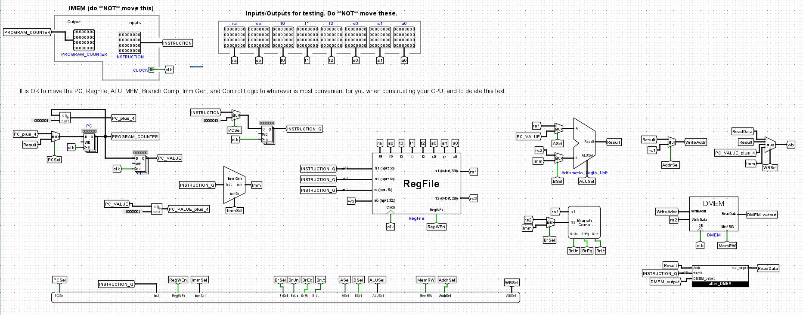

# CPU Project

## Description

This project is a CPU implementation created as part of a computer organization course. The goal of the project was to design and build a fully functional CPU, demonstrating an understanding of complex computer systems concepts.

The CPU is designed to execute basic instructions and perform arithmetic and logical operations. It consists of various components, such as the ALU (Arithmetic Logic Unit), control unit, and registers.

## Features

- Instruction Fetch: Fetches instructions from memory for execution.
- Instruction Decode: Decodes the fetched instruction to determine the operation.
- Arithmetic Logic Unit (ALU): Performs arithmetic and logical operations.
- Control Unit: Controls the flow of data and instructions within the CPU.
- Registers: Stores data and intermediate results during execution.

## Prerequisites

Make sure you have the following software installed:

- [Git](https://git-scm.com/): Version control system used to manage the project.
- [Python](https://www.python.org/): Python programming language used for simulation.
- [Logisim](http://www.cburch.com/logisim/): Logic circuit simulator used for CPU design and testing.

## Getting Started

These instructions will help you set up and run the CPU project on your local machine for testing and exploration.

### Installation and Usage

1. Clone this repository to your local machine:
2. Navigate to the project directory:

3. [Instructions to run the CPU simulation using Python and Logisim]

For detailed installation and testing instructions, refer to [this link](https://cs61c.org/su23/projects/proj3/).

## Contributing

Contributions are welcome! If you find any bugs or have suggestions for improvements, please open an issue or submit a pull request.

## Contact

If you have any questions or inquiries about this project, please feel free to contact me:

- Name: Mohmed Elngar
- Email: mohmedelngar91@gmail.com
- LinkedIn: linkedin.com/in/mhmd-elngar-1196a7139/
- GitHub: github.com/mhmdelngar
